# Introducción

El desarrollo de software moderno requiere métodos agiles para desplegar y
escalar cada vez más sistemas distribuidos con alta demanda. Los practicantes han
adoptado la arquitectura de microservicios para afrontar los retos generados
por las demandas del software moderno. Sin embargo, la adopción de esta
arquitectura también crea retos técnicos y organizacionales, realentizando
potencialmente a los equipos de desarrollo y operaciones, que requieren más
tiempo y esfuerzo para implementar un proceso de despliegue de calidad que les
permita liberar constantemente nuevas características a producción.
La adopción de una cultura DevOps, junto con sus prácticas y herramientas,
mitigan algunos de estos nuevos retos. En este trabajo se presenta la propuesta
de una guía para el despliegue de sistemas con una arquitectura de
microservicios, considerando las prácticas de una cultura DevOps,
proporcionando a los practicantes un camino base para comenzar a implementar
la plataforma que una arquitectura de microservicios requiere.

## Objetivo

El objetivo de este trabajo es asistir a los Arquitectos de Software,
Ingenieros de Software, Ingenieros de Infraestructura, Ingenieros de Confiabilidad
del Sitio (SRE), desarrolladores, equipos DevOps o a todos aquellos que tengan las
responsabilidad de diseñar e implementar los procesos e infraestructura necesaria
para el despliegue de sistemas con arquitectura de microservicios.

## Contenido

La guía presentada propone prácticas, principios y tecnologías encontradas a
través de un Mapeo Sistemático de la Literatura (MSL) [@nino2021microservices] y una revisión de
literatura gris, estas tuvieron como objetivo la identificación del proceso y
practicas usadas en la industria para el despliegue de una arquitectura basada
en microservicios considerando principios de una cultura DevOps.

## Casos de uso

+ La guía puede ser usada por aquellos que están en el proceso de migración de un
sistema monolítico a una arquitectura de microservicios.
+ La guía puede ser usada por aquellos que ya implementaron esta arquitectura
pero quieren implementar nuevas prácticas relacionadas con DevOps o sus principios.
+ La guía puede ser usada para mejorar procesos existentes en la organización
alineandose a los principios referenciados.

## Estructura de la guía

La guía se encuentra estructurada tomando en cuenta un modelo de procesos para
la implementación de microservicios, para el modelado se utilizó SPEM [^1]. En
cada sección se presentan principios, tareas, artefactos, tecnologías,
recomendaciones y recursos encontrados en la literatura.

[^1]: [Software & Systems Process Engineering Meta-Model Specification](https://www.omg.org/spec/SPEM/2.0/PDF)

**Sección 1 Introducción,** como se nombre lo indica es una introducción al tema de microservicios así como a los conceptos relacionados con este estilo arquitectónico, incluye un glosario que los lectores puden consultar para enter coceptos comúnes usados a lo largo de la guía.

**Sección 2 Procesos,** en esta sección se presenta el modelado de las actividades y tareas utilizadas a lo largo de la guía, el moleado de los procesos fue realizado utilizando la notación de SPEM.

**Sección 3 Diseño del despliegue,** en esta sección se incluyen las actividades y tareas que se deben llevar cabo en la etapa de diseño enfocadas al despliegue de microservicios, se cubren los patrones existentes del despliegue, tecnologías y prácticas comúnes.

**Sección 4 Administración del entorno de desarrollo,** cubren las actividades y tareas que deben ser implementadas para el correcto desarrollo e integración de cambios en cada uno de los microservicios a desarrollar. Estas tareas son requisito para la siguiente sección *Pipeline de despliegue*.

**Sección 5 Pipeline de despliegue,** es todo sobre las tareas que se deben implementar para liberar continuamente cambios a un ambiente de producción. Se describen las prácticas de *Integración y Entrega Continua*.

**Sección 6 Administración de la infraestructura,** cubren actividades y prácticas  para el manejo de la infraestructura en la organización. Se incluyen prácticas como *Infraestructura como código*.

## Fundamentos

### Sistemas distribuidos

Un sistema distribuido es aquel en el cual componentes de hardware o software situados 
en computadoras conectadas en red se comunican y coordinan sus acciones solo mediante 
el paso de mensajes [@coulouris2001distributed].

#### Características

##### Concurrencia

En uina red de computadoras, la ejecución concurrente de programas es la norma. 
Pueden trabajar en computadoras diferentes dos personas mientras comparten 
recursos como páginas web o archivos cuando sea necesario. La capacidad del 
sistema para manejar recursos compartidos se puede aumentar agregando más 
recursos (por ejemplo, computadoras) a la red.

##### Falta de un reloj global

Cuando los programas necesitan cooperar, coordinan sus acciones mediante el intercambio 
de mensajes. La coordinación estrecha a menudo depende de una idea compartida del
momento en que ocurren las acciones de los programas. Pero resulta que hay límites en la
precisión con la que las computadoras en una red pueden sincronizar sus relojes: no existe
una noción global única de la hora correcta.

##### Fallos independientes

Todos los sistemas informáticos pueden fallar, y es responsabilidad de los diseñadores de
sistemas planificar las consecuencias de posibles fallas. Los sistemas distribuidos pueden
fallar de nuevas maneras. Las fallas en la red provocan el aislamiento de las computadoras
que están conectadas a ella, pero eso no significa que dejen de funcionar.

#### Retos

+ Heterogeneidad
+ Apertura
+ Seguridad
+ Escalabilidad
+ Manejo de fallas
+ Concurrencia
+ Transparencia

### Arquitectura orientada a servicios

La arquitectura orientada a servicios (SOA) es un paradigma para la realización y el
mantenimiento de procesos empresariales que abarcan grandes sistemas distribuidos. Se
basa en tres conceptos técnicos principales: los servicios, la interoperabilidad a través de
un bus de servicios empresariales y el acoplamiento flexible [@josuttis2007soa].
SOA no es una arquitectura concreta, es algo que conduce a una arquitectura concreta.
Es un estilo, paradigma, concepto, una forma de pensar, un sistema de valores que conduce
a ciertas decisiones concretas a la hora de diseñar una arquitectura de software concreta.

#### SOA y Microservicios

Hay una relación entre SOA y microservicios, ambas arquitecturas buscan resolver los
retos de una aplicación monolítica grande. Sin embargo, a pesar de contar con importantes
aportaciones, SOA sigue dejando muchas cosas sin entender; no consigue hablar de las
formas prácticas en el mundo real. En cambio, el enfoque de microservicios ha surgido de
su uso en el mundo real, tomando la mejor comprensión de los sistemas y la arquitectura
para hacer bien SOA [@newman2015].
Existen varias cosas en las que difiere SOA de microservicios, sin embargo la principal 
diferencia entre los dos enfoques se reduce al alcance. La arquitectura orientada a
servicios (SOA) tiene un alcance empresarial, mientras que la arquitectura de microservicios 
tiene un alcance de aplicación [^2]. Además del alcance podemos encontrar
ciertas diferencias en la implementación de algunos conceptos los cuales se presentan a
continuación.

[^2]: Team, I. C. (2021, 5). Soa vs. microservices: What’s the difference? | ibm. Consultado de
https://www.ibm.com/cloud/blog/soa-vs-microservices

### Arquitectura de Microservicios

Una Arquitectura de Microservicios (MSA, por sus siglas en inglés) como un 
estilo arquitectónico con un enfoque para desarrollar un aplicación como un 
conjunto de pequeños servicios, cada uno ejecutándose en su propio proceso y
comunicándose mediante mecanismos ligueros [^3]. Las organizaciones
han encontrado que adoptando una MSA pueden entregar software con mayor rapidez y
adoptar nuevas tecnologías, además, brindan una mayor libertad para reaccionar y tomar
diferentes decisiones permitiendo responder más rápido a los cambios inevitables que los
afectan.


[^3]: Lewis, J., y Fowler, M. (2014, 3). Microservices. Consultado de https://martinfowler.com/articles/microservices.html

En comparación con una arquitectura monolítica la cual podemos definir como una
aplicación con un único código base/repositorio que expone decenas o cientos de servicios
diferentes a sistemas o consumidores externos utilizando diferentes interfaces como servicios
web y/o servicios REST. El código base puede desplegarse en entornos de un solo servidor
o en múltiples servidores usando un balanceador de cargas.

Los conceptos fundamentales detrás de una MSA no son nuevos, sin embargo, la implementación 
contemporánea que ha tenido si lo ha sido. Su adopción a sido impulsada en
parte por los retos de escalabilidad, la falta de eficiencia, la lentitud de los desarrolladores
y las dificultades para adoptar nuevas tecnologías que surgen cuando los sistemas complejos 
están contenidos en una gran aplicación monolítica y se despliegan como tal [@fowler2016production].

Con una MSA una aplicación puede fácilmente escalar vertical y horizontalmente,
la productividad y velocidad de los desarrolladores incrementa drásticamente y tecnologías
viejas pueden ser ser intercambiadas con facilidad con las más nuevas. Sin embargo, una
MSA introduce retos por si misma: un ecosistema exitoso y escalable require una 
infraestructura estable y sofisticada; cambios radicales en la estructura organizativa de una
empresa para permitir las nuevas estructuras de equipos que se derivan de la adopción de
esta arquitectura; finalmente uno de los mayores retos es la necesidad de estandarización
de la arquitectura de los servicios así como sus requisitos para garantizar la confianza y la
disponibilidad [@fowler2016production].

#### Beneficios

+ Heterogeneidad de la tecnología
+ Resilencia
+ Escalamiento
+ Facilidad de despliegue
+ Alineación organizativa
+ Reusabilidad
+ Optimización en la capacidad de sustitución

### Cultura DevOps

Dada la importancia de la madurez del despliegue en los microservicios, la actualización
constante de cada servicio y la necesidad de automatización, se ha comprobado que la
implantación de una cultura DevOps junto con sus prácticas y herramientas cubre los
requisitos de esta arquitectura [@bolscher2019].

Podemos definir a DevOps como un conjunto de principios y prácticas que permiten una
mejor comunicación y colaboración entre las partes interesadas relevantes para especificar,
desarrollar y operar productos y servicios de software y sistemas y mejoras continuas en
todos los aspectos del ciclo de vida [@olszewska2021ieee].

El término DevOps evolucionó a partir de la disponibilidad de herramientas de crea-
ción, empaquetado y despliegue de aplicaciones totalmente automatizadas, junto con el
reconocimiento de que las organizaciones de tecnología de la información (TI) no estaban
preparadas para utilizar esas herramientas de forma eficaz.

Podemos definir a DevOps como un conjunto de principios y prácticas que permiten una
mejor comunicación y colaboración entre las partes interesadas relevantes para especificar,
desarrollar y operar productos y servicios de software y sistemas y mejoras continuas en
todos los aspectos del ciclo de vida [@olszewska2021ieee].

#### Principios

+ Negocio o misión primero
+ Centrado en el cliente
+ Cambio a la izquierda y todo continuo
+ Pensamiento sistemático

#### Prácticas

+ Gestión de la configuración (CM)
+ Automatización de infraestructura
+ Integración continua (CI)
+ Entrega Continua (CD)
+ Despliegue continuo
+ Bitácora (Loggin)
+ Monitoreo

## Glosario

### *Máquina virtual*

Es un entorno virtual que funciona como sistema informático virtual con su 
propia CPU, memoria, interfaz de red y almacenamiento, pero se crea en un 
sistema de hardware físico, ya sea en las instalaciones o no.

### *Contenedor*

Un contenedor es una unidad estándar de software que empaqueta el código y 
todas sus dependencias para que la aplicación se ejecute de forma rápida y 
confiable de un entorno informático a otro.

### *Despliegue*

Etapa de un ciclo de vida en el que se pone en funcionamiento un sistema y se 
resuelven los problemas de transición.

### *Infraestructura*

Instalaciones como energía, enfriamiento y seguridad física del centro de 
datos, redes, hardware y software necesarios para respaldar el ciclo de vida 
de los sistemas y mantener los servicios de tecnología de la información (TI).

### *Pipeline*

Técnica de diseño de software o hardware en la que la salida de un proceso 
sirve como entrada a un segundo, la salida del segundo proceso sirve como 
entrada a un tercero, y así sucesivamente, a menudo con simultaneidad dentro 
de un tiempo de ciclo único.

# Procesos para la adopción de microservicios

Para darle un orden darle un orden al conjunto de tareas y actividades, se decidió realizar un modelado del proceso sugerido para la implementación de una arquitectura de microservicios. Para el modelado se usó SPEM, un estándar para definir procesos de software. Como se menciona en la especificación oficial [^4], SPEM permite proveer una representación estandarizada y bibliotecas de contenido reutilizable, soporta desarrollo sistemático, administración y crecimiento de procesos de desarrollo, soporte de despliegue de contenido de métodos y procesos necesitados por configuraciones definidas, entre otros.

[^4]: [Software & systems process engineering meta-model specification](https://www.omg.org/spec/SPEM)

El alcance de SPEM está limitado deliberadamente a los elementos mínimos necesarios para definir cualquier proceso de desarrollo de software y sistemas, sin añadir características específicas para dominios o disciplinas de desarrollo particulares.

SPEM utiliza la notación UML _Unified Modeling Language_, provee componentes que permiten representar de manera estandarizada métodos, ciclos de vida, roles, actividades, tareas y productos de trabajo que se usan en la ingeniería de software. Se utilizó en este documento la versión de SPEM 2.0, la cual se utiliza para definir los procesos de desarrollo de software, sistemas y sus componentes.

## Notación


**Fase:** La fase representa un período significativo en un proyecto, que termina con un punto de control de gestión importante, un hito o un conjunto de
Entregables.

**Iteración:** La iteración agrupa un conjunto de Actividades anidadas que se repiten más de una vez. Representa un importante elemento estructurador para organizar el trabajo en ciclos repetitivos. El concepto de Iteración puede asociarse a diferentes reglas en diferentes métodos.

**Proceso:** Un proceso es una actividad especial que describe una estructura para determinados tipos de proyectos de desarrollo o partes de ellos.

**Actividad:** Definición de un trabajo, elemento de planeación, una acción.

**Tarea:** Una Definición de Tarea es un Elemento de Contenido de Método y una Definición de Trabajo que define el trabajo que realizan las instancias de Definición de Roles. Una Tarea está asociada a Productos de Trabajo de entrada y salida. Las entradas se diferencian en obligatorias y opcionales.

## Proceso general

Para describir los procesos y actividades siguiendo un enfoque de modelado orientado
a objetos con base en UML se ha utilizado SPEM. Como punto de partida se definieron
tres fases principales, las cuales son iterativas y en las que es posible regresar
si llegara a ser necesario.
La primera fase corresponde al diseño de la arquitectura, es aquí en dónde se toman las
decisiones respecto a que servicios se crearán, cómo se comunicaran entre
ellos, cómo se manejará la información y finalmente cómo se desplegaran los
servicios. Es importante mencionar que no se llevó a cabo el modelado de las actividades
de todas las iteraciones de la fase de diseño, para los objetivos de esta guía
solo nos concentramos en la última iteracion la cual definimos como la iteración
de _Diseño y planeación del despliegue_.

En la segunda fase, se prepara el entorno de desarrollo para cada
servicio, se definen las actividades a realizar para la construcción,
integración y despliegue de cada servicio así como la estrategia para liberar
las funcionalidades y observar el comportamiento de cada servicio en un entorno
de producción. Es en esta fase en donde esta la mayor parte de las actividades
presentadas en la guía, sin embargo, como sabes estas actividades no son sencillas y
requieren mucho tiempo e iteraciones refinarlas, por lo tanto es posible comezar las
actividades e ir mejorandolas y terminandolas conforme se avanza con las siguientes fases.

Finalmente, en la tercera fase se realiza la construcción de los
servicios así como su integración siguiendo el diseño y procesos definidos en
las fases anteriores. Esta fase a pesar de estar modelada, no se abarca en la guía y
tampoco se desarrollaron los diagramas de las actividades que están involucradas
en esta fase. Si quieres aprender a construir microservicios, te recomendamos que
utilices alguna de las referencias utilizadas en esta guía, algunas de estas son
lbros que involucran la construcción de microservicios.


### Diseño de la arquitectura y planeación del despliegue

La fase de diseño de la arquitectura cuenta con un conjunto de iteraciones, una
iteración es un conjunto de tareas o actividades que se pueden realizar una o
muchas veces de forma incremental. Dentro de estas iteraciones se encuentran el
descubrimiento y separación de servicios,la descomposición y estrategias para
el manejo de los datos, la definiciónd el mecanismo de comunicación entre
microservicios y finalmente la iteración para el diseño y planeación del
despliegue del sistema. Es en esa última iteración en donde comenzará el
alcance de la presente guía.

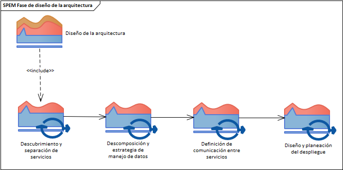

Dentro de de esta iteración se encuentran un conjunto de tareas que
se describirán con mayor detalle en las secciones posteriores. Esta iteración
es importante ya que es aquí es donde se decidirá la estrategia para desplegar
los microservicios y esta decisión decidirá que tecnologías se usarán en las
siguientes fases. A continuación se muestran las tareas y salidas esperadas de
cada una de ellas

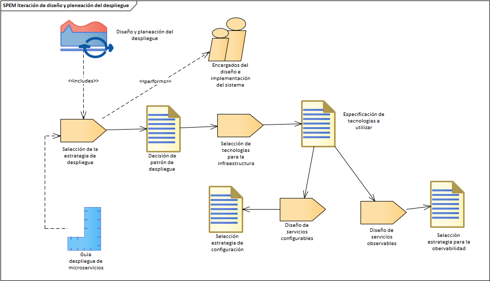

### Preparación plataforma para microservicios

En esta fase se comienza la construcción de la infraestructura, procesos de
integración, despliegue de servicios y flujos de trabajo que soportarán la fase
de construcción. Toda esta fase será abordada en la guía, en la figura se
muestran las tres principales iteraciones. En la primera se crea el pipeline de
despliegue que permitirá integración y liberación constantemente de
funcionalidades. En la segunda, se muestra cómo se debe llevar el control de la
infraestructura del sistema y finalmente en la tercera se implementan aspectos
de la observabilidad.

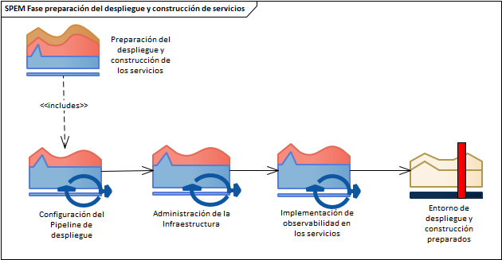

#### Configuración del pipeline de despliegue

En esta iteración se realizan tres actividades principales las cuales tienen a
su vez un conjunto de tareas. En la figura se muestran las actividades, además
se espera que cada actividad vaya soportando el desarrollo de la siguiente
actividad. En la primera figura 6, se prepara el entorno de desarrollo para la
construcción de los servicios, estandarizando los procesos y forma de trabajar
para cada uno de los distintos servicios a desarrollar.

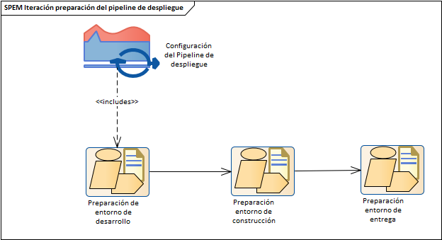

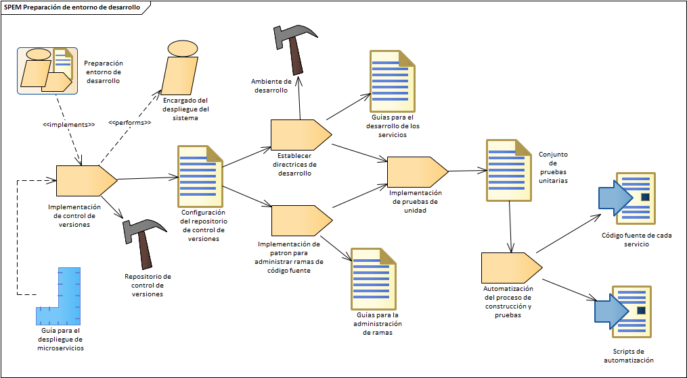

En la segunda actividad figura 7, se lleva a cabo el proceso para la
automatización del proceso de construcción del software, es en esta actividad
en donde se implementa la integración continua en conjunto con los principios DevOps.

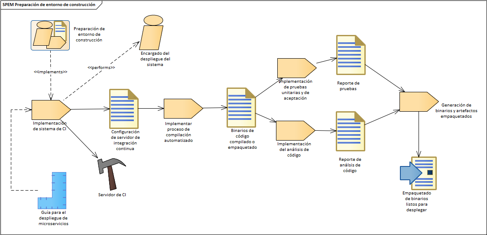

En la última actividad figura 8 se implementa la práctica de entrega continua
para preparar la entrega de software en los diferentes ambientes.

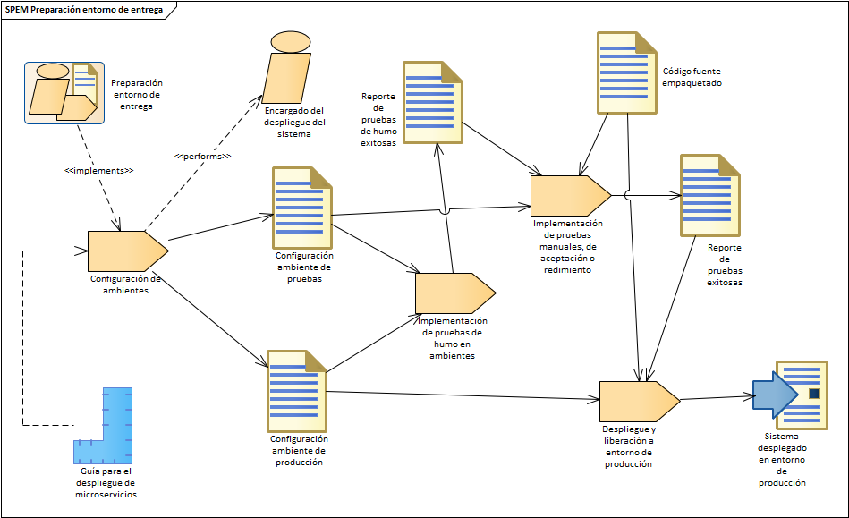

#### Administración de la infraestructura

En esta iteración figura 9 se realiza el manejo de la configuración de la
infraestructura del sistema y se implementan prácticas como administración de
la infraestructura y GitOps.

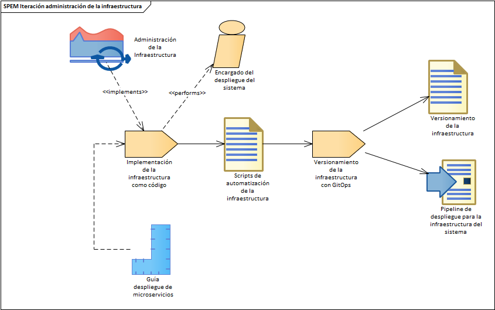

#### Implementación de observabilidad de los servicios

En la última iteración se implementa el sistema de monitoreo para la
obtención de métricas y trazabilidad. Además de el monitoreo se realiza la
implementación de un sistema para el manejo de los logs.

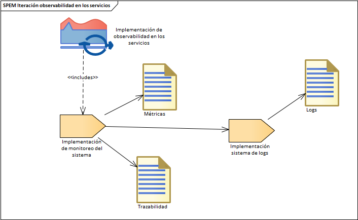

# Diseño del despliegue

El diseño es una de las actividades más importantes en la adopción de una
arquitectura basada en microservicios, en esta arquitecta cada servicio cuenta
con su propio proceso de despliegue, cada uno de ellos puede ser desarrollado
usando distintas tecnologías que a su vez cuentan con sus propios requisitos
para ser desplegados. A su vez, se necesitan mecanismos para la comunicar los
servicios, monitorear su estado, sin mencionar los motores de bases de datos o
sistemas de cache que son usados para lidiar con altas demandas. Es por esto que
antes de comenzar a crear tus pequeños servicios que realizan una tarea bien,
debes tomar muchas decisiones técnicas y considerar algunos aspectos como:

- ¿Cómo separar tu aplicación monolítica en pequeños servicios?
- ¿Cómo manejar los datos de tu sistema?
- ¿Cómo se comunicaran tus servicios entre ellos y con los clientes?
- ¿Cómo lograr que tus servicios sean resistentes a fallas?
- ¿Cómo reutilizar servcios y agilizar la construcción de los mismos?
- ¿Cómo estandarizar el despliegue y liberar continuamente servicios listos
  para producción?

## Acerca de la sección

En esta sección nos enfocaremos solo el diseño del último punto de los mencionados
anteriormente que consiste en la _estandarización de los artefactos de despliegue_ y
_liberación continua de servicios_ listos para un ambiente de producción. Estos
son los dos objetivos principales de la sección y de la guía.

Esta sección presenta los distintos patrones que se han encontrado en la literatura
para resolver estos retos. Las subsecciones presentadas derivan de las tareas
descritas en la sección de [_Procesos_](#procesos-para-la-adopcion-de-microservicios).

## Arquitectura de un sistema de microservicos

### Arquitectura

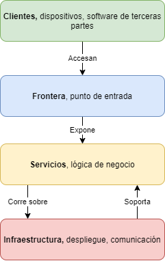

### Ecosistema

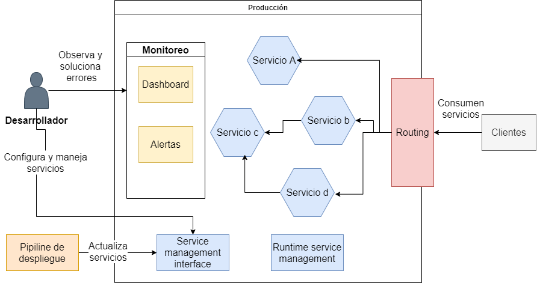

#### Capa 1: Hardware

- Servicios físicos en donde se ejecuraran los servicios.
- Los servidores pueden ser propiedad de la empresa o rentados a proveedores de la nube.
- La gestión de los servidores forma parte de esta capa, esto incluye la instalación
  del sistema operativo, la configuración de tecnologías que se ejecutan sobre la
  la capa de hardware para su abstracción.
- Cada host debe ser provisionado y configurado usando herramientas de administración
  de la configuración.
- Es necesario tener un monitoreo y bitácora a nivel de host, para lograr un rápido
  diagnostico, mitigación y resolución de errores.

##### Herramientas

#### Capa 2: Comunicación

- Esta capa contiene la red, DNS, RCPs, endpoints del API, service discovery,
  service registry y balancedores de carga.
- Una MSA requiere que se implementen en esta capa: service discovery, service
  registry y load balancing; con el fin de tener una efectiva y eficiente comunicación.

**Tecnologías de descrubrimiento de servicios**

- etcd
- Consult
- Hyperbahn
- ZooKeeper

**Tecnologías de balanceamiento de cargas**

- Amazon Web Services Elastic Load Balancer
- Netflix Eureka
- HAProxy
- Nginx

#### Capa 3: Plataforma de la aplicación

- Esta capa contiene todas las herramientas internas que son independientes a los
  microservicios.
- Esta capa se desarrolla de tal manera que los equipos de desarrollo de microservicios
  no tengan que diseñar, construir o mantener nada más que su propios microservicios.

Esta capa debe de contar con:

- Herramientas internas para los desarrolladores
- Un proceso de desarrollo estandarizado
- Un centralizado y automatizado sistema de construcción y entrega.
- Pruebas automatizadas
- Una solución de despliegue estandarizada y centralizada
- Un centralizado sistema de monitoreo y bitácoras a nivel de microservicios.

#### Capa 4: Microservicios

- En esta capa se encuentran los microservicios y lo correspondiente a ellos.
- Los microservicios deben estar abstraidos de las capas de infraestructura.
- Lo único que no se abstrae en esta capa son las configuraciones especificas de cada microservicio.
- Una buena práctica es centralizar las configuraciones de las aplicaciones así como la de las herramientas.

### Aspectos a considerar del despliegue

- El despliegue debe de ser aburrido
- Cuanto más rápido pueda desplegar nuevos servicios y cambios, más rápido podrá
  iterar y ofrecer valor a sus usuarios finales [@bruce2018microservices].
- El despliegue debe maximizar la seguridad: debes validar en la medida de lo posible
  que un determinado cambio no afectará negativamente a la estabilidad de un servicio [@bruce2018microservices].
- La consistencia de proceso de despliegue en diferentes servicios, independientemente
  de la pila de tecnología subyacente, ayuda a aliviar el aislamiento técnico y hace
  que las operaciones sean más predecibles y escalables [@bruce2018microservices].

## Estrategia de despliegue

### Acerca de la tarea

#### Tipo

Decisión técnica

#### Roles encargados

- Encargado de diseño
- Encargado de despliegue

#### Descripción

Patrones de despliegue identificados en la literatura, los patrones fueron
obtenidos de [@richardson2018microservices].

> Para tener mayor información acerca de los detalles de su implementación se
> recomienda consultar las fuentes citadas.

### Multiple service instances per host

#### Características

- Enfoque tradicional para el despliegue de aplicaciones
- En este enfoque se pueden hosts físicos o virtuales

- Multiples servicios son ejecutados en solo host

- La instancia de un servicio puede ser ejecutada en un proceso o en
  grupo de procesos

- Es posible ejecutar múltiples instancias en el mismo proceso o
  grupos de procesos

#### Ventajas

- El uso de recursos es relativamente eficiente

- El despliegue de la instancia de un servicio es relativamente rápido

- Debido a la falta de gastos generales, el inicio de un servicio
  suele ser muy rápido.

#### Desventajas

- Hay poco o ningún aislamiento de las instancias de los servicios, a
  menos que estén en procesos separados

- Riesgo de requisitos de recursos contradictorios

- Riesgo de versiones de dependencia en conflicto

- Dificultad al limitar los recursos consumidos por una instancia de
  servicio

- Dificultad monitorear el consumo de recursos de cada instancia de
  servicio si se implementan servicios en el mismo proceso.

- El equipo de operaciones debe conocer los destalles específicos de
  como implementar el despliegue.

### Single service instance per host

#### Características

- Cada instancia de servicio es ejecutada en aislamiento en su propio
  host

- Existen dos especializaciones para esta estrategia: Instancias por
  Máquina Virtual o por Contenedor.

#### Ventajas

- Las instancias de los servicios están asiladas unas de otras

- No hay posibilidad de conflictos en los requisitos o versiones de
  las dependencias

- Una instancia de servicio solo puede consumir como máximo los
  recursos de un solo host

- Es sencillo monitorear, administrar y volver a implementar cada
  instancia de servicio

#### Desventajas

- Menor eficiencia en la utilización de recursos

### Service instance per VM

#### Características

- Empaquetas cada servicio como una máquina virtual

- Cada servicio es una máquina virtual

- Netflix despliega sus servicios de streaming de video de esta forma

#### Tecnologías

- Animator

- Parcker.io

- Boxfuse

#### Ventajas

- Cada servicio corre en completo aislamiento

- Puedes aprovechar la infraestructura de la nube

- Abstracción de las tecnologías de implementación del servicio. Los
  servicios son comenzados y detenidos de la misma manera.

- El escalado de los servicios aumentando el número de servicios

- Soluciones de IaaS proporcionan funciones para administrar máquinas
  virtuales.

#### Desventajas

- Menor eficiencia en la utilización de recursos

- El despliegue de una nueva versión de un servicio es usualmente
  lento

- Por lo general alguien en la organización es responsable de una gran
  cantidad de trabajo pesado

### Service instance per container

#### Características

- Cada servicio se ejecuta en su propio contenedor

- Es posible limitar la memoria y los recursos de CPU de cada
  contenedor

- Tu servicio es empaquetado como una imagen

- Se pueden ejecutar múltiples contenedores en cada host fisicos o
  virtuales

#### Tecnologías

- Docker

- Solaris Zones

- Kubernetes

- Marathon

#### Ventajas

- Aíslan cada instancia de servicio una de otra

- Puedes monitorear con facilidad los recursos consumidos por cada por
  cada contenedor.

- Abstraen la tecnología usada en la implementación de tus servicios

- Cuentan con API que permite administrar tus servicios

- A diferencia de las máquinas virtuales, los contenedores son una
  tecnología ligera

- Las imágenes de contenedores son regularmente muy rápidas de
  construir

- Los contenedores son extremadamente rápidos de construir y comenzar

#### Desventajas

- La infraestructura para implementar contenedores no es tan rica como
  la infraestructura para implementar máquinas virtuales

- Cuando se trata de performance los contenedores no son tan buenos
  como las máquinas virtuales [@PerformanceConteinerVM]

### Serverless deployment

#### Características

- Empaquetado y cargado como un archivo ZIP en un provedor de la nube

- Se factura por cada solicitud en función del tiempo usado y la
  memoria consumida

- Una función lambada es una función sin estado

#### Tecnologías

- AWS Lambda

- Google Cloud Functions

- Azure Functions

#### Ventajas

- Elimina la necesidad de dedicar tiempo al trabajo pesado
  indiferenciado de administrar la infraestructura de bajo nivel. En
  su lugar, puede concentrarse en su código

- La infraestructura de implementación sin servidor es extremadamente
  elástica. Escala automáticamente sus servicios para manejar la carga

- Paga por cada solicitud en lugar de aprovisionar lo que podrían ser
  máquinas virtuales o contenedores infrautilizados.

#### Desventajas

- Limitaciones y restricciones significativas: un entorno de
  implementación sin servidor generalmente tiene muchas más
  restricciones que una infraestructura basada en máquinas virtuales o
  en contenedores.

- Fuentes de entrada limitadas: las lambdas solo pueden responder a
  solicitudes de un conjunto limitado de fuentes de entrada

- El inicio es mucha más lento

- Riesgo de latencia alta: el tiempo que tarda la infraestructura en
  aprovisionar una instancia de su función y la función en
  inicializarse puede resultar en una latencia significativa.

#### Recomendaciones

- La selección del patrón de despliegue debe de ser elegida teniendo
  en cuenta los recursos económicos, técnicos y humanos de la
  organización.

- Se ha identificado en la literatura que el patrón **Service instance
  per container** junto con un framework de orquestación como
  Kubernetes son la mejor opción para conseguir los beneficios que una
  arquitectura de microservicios ofrece (insertar cita a nuestro
  articulo)

### Recursos

- [Sam Newman: "Deploying And Testing Microservices"](https://www.youtube.com/watch?v=FotoHYyY8Bo)

## Tecnologías

### Acerca de la tarea

#### Nombre

Selección de tecnologías

#### Tipo

Decisión técnica

#### Roles encargados

- Encargado de diseño

- Encargado de despliegue

#### Descripción

La correcta selección de tecnologías en el despliegue es un aspecto
importante, ya que si se realiza un cambio de tecnología en el futuro
una vez que el proyecto ya este en marcha el costo de mucho mayor. Para
prevenir esto, se presentan un conjunto de tecnologías que se han
encontrado en la literatura y han sido usadas por los practicantes.

### Alojamiento en la nube

#### Ventajas [@computoEnNubeVD] [@computoNubeUNAM]

- Escalabilidad y flexibilidad

- Optimización de costes

- Disponibilidad

- Seguridad

- Facilidad de uso

#### Desventajas [@computoEnNubeVD] [@computoNubeUNAM]

- Control limitado

- La información esta

- Dependencia de internet

- Dependencia de los servicios de un proveedor

- Privacidad, al delegar la seguridad de la información a terceros

- Disponibilidad a cargo del proveedor, si no se llegara a recuperar
  el cliente no podría hacer nada

- Falta de control sobre recursos, una vez que la información se sube
  a la nube el cliente ya no tiene control sobre estos

- Integración, no para todos los entornos resulta sencillo una
  integración en la nube

#### Proveedores de la nube

A continuación se presentan una lista de los proveedores de la nube con
mayor presencia en el mercado.

- Amazon Web Services (AWS)

- Microsoft Azure

- Google Cloud Platform (GCP)

- DigitalOcean

- Oracle Cloud

- IBM Cloud

- Alibaba Cloud

- Kamatera

- Linode

## Servicios configurables

### Acerca de la tarea

#### Nombre

Servicios configurables

#### Tipo

Decisión técnica

#### Roles encargados

- Encargado de diseño

- Encargado de despliegue

#### Descripción

Un aspecto importante en el desarrollo de microservicios es la
configuración de los mismos, cada servicio puede utilizar distintos
recursos de base de datos, frameworks para el manejo de mensajes o
eventos. Estas configuraciones pueden cambiar dependiendo del ambiente
en el que se esté ejecutando el servicio. Como veremos más adelante,
como buena práctica se debe contar con al menos dos ambientes el de
pruebas y el de producción. Para lograr que los servicios se pueden
ejecutar en estos ambientes es necesario externalizar su configuración.
Existen enfoques identificados por [@richardson2018microservices] para
el manejo de la configuración, estos se describen a continuación.

### Push model

#### Características

- La infraestructura de despliegue pasa las configuraciones al
  servicio usando variables de entorno del sistema operativo o un
  archivo de configuraciones.

- Con este enfoque la infraestructura de despliegue no te permite
  cambiar la configuración de un servicio en ejecución sin
  reiniciarlo.

- Existe un riesgo de que los valores de configuración comiencen a
  dispersarse a través de la elaboración de numerosos servicios

### Pull model

#### Características

- La instancia del servicio lee las propiedades de configuración de un
  servidor de configuración

- Al inicio, la instancia de un servicio busca el servicio de
  configuración por su configuración.

- La configuración para acceder al servicio de configuración es
  inyectada mediante el mecanismo de push model

#### Beneficios

- Configuración centralizada

- Descifrado transparente de información sensible

- Reconfiguración dinámica

#### Desventajas

- Es otra pieza de infraestructura que necesita ser configurada y
  mantenida

#### Recomendaciones

- En el control de versiones, junto al servicio almacenar las
  configuraciones [@bruce2018microservices]

- Siempre que sea posible, almacene los secretos en un sistema de
  gestión de secretos adecuado, o cifre los secretos con un sistema de
  gestión de claves [@bruce2018microservices] [@adkins2020building]

- Nunca registres los secretos en el control de versiones ni incrustes
  los secretos en el código fuente.[@adkins2020building]

- Nunca registre los secretos en el control de versiones ni incruste
  los secretos en el código fuente. [@adkins2020building]

- Cuando este sea un uso válido uso, crea credenciales separadas para
  humanos y servicios. [@adkins2020building]

#### Tecnologías

- Hashicorp Vault

- AWS Parameter Store

- Cloud KMS

- SQL and NoSQL databases

## Servicios observables

### Acerca de la tarea

#### Nombre:

Servicios configurables

#### Tipo:

Decisión técnica

#### Roles encargados:

- Encargado de diseño

- Encargado de despliegue

- Desarrollador

#### Descripción

La observabilidad de los microservicios debe de ser implementado en
varias capas de la arquitectura, es necesario tener saber que esta
sucediendo en la infraestructura y en los servicios. El equipo de
operaciones es responsable de la infraestructura como servidores,
bitácoras, métricas, trazabilidad de excepciones. Los desarrolladores
son responsables de que sus servicios sean observables. Para lograr esto
nivel de la capa de microservicios existen un conjunto de patrones que
nos pueden ayudar.

### Patrones de observabilidad

Solo se describen de manera general los patrones, para mayor información
acerca de ellos consultar [@richardson2018microservices]

#### Health check API

Expone un endpoint que retorna el estado del servicio

#### Log aggregation

Registra la actividad del servicio y los escribe en u servidor de
registros centralizado

#### Distributed tracing

Asigna cada solicitud externa un identificador único, rastrea las
solicitudes y su flujo entre servicios

#### Exception traking

Reporta las excepciones a un servicio de ratreo de excepciones el cual
notifica a los desarrolladores y hace el seguimiento de su estado

#### Application metrics

Almacena las métricas del servicio y las expone a un servidor de
métricas externo

#### Audit logging

Registra las acciones de los usuarios

### Microservice chassis

Este patrón es un marco que se encarga de manejar las preocupaciones y
patrones base mencionados anteriormente.

#### Beneficios

- Reduce la cantidad de código que debes escribir

- Es rápido el desarrollo de un nuevo servicio

- Te permite concentrarte en la lógica del negocio

- Se adapata a tus requisitos

#### Desventajas

- Necesitas crear un chassis para cada lenguaje y combinación de
  plataformas que uses para desarrollar los servicios

### Service mesh

Este patrón dirige todo el tráfico de red que entra y sale de los
servicios a través de una capa de red que implementa varias
preocupaciones, incluyendo interruptores de circuito, rastreo
distribuido, descubrimiento de servicios, equilibrio de carga y
enrutamiento de tráfico basado en reglas

#### Beneficios

- Evita los problemas de implementar un chassis ya que externaliza la
  implementacion de las funcionalidades

- Puede asegurar la comunicación entre procesos

#### Tecnologías

- Istio

- Linkerd

- Conduit

# Administración de la configuración y entorno de desarrollo

A diferencia de una aplicación monolítica en la cual se puede optimizar el despliegue 
para un único caso, en un sistema basado en microservicios es necesario escalar 
y actualizar múltiples servicios, los cuales pueden estar escritos en distintos 
lenguajes de programación y frameworks los cuales a su vez cuentan con sus propias 
dependencias. 
Debido a estas particularidades, es necesario contar con un consistente y robusto 
mecanisco de despliegue que cuente con las herramientas e infraesructura necesaria 
para poder lograr aprovechar los beneficios de esta arquitectura.
Es posible alcanzar estos mecanismos maduros de despliegue mediante la implementación 
de principios y prácticas DevOps como: *Integración Continua (CI)* y *Entrega Continua (CD)*.

## Acerca de la sección

En esta sección se presentan las tareas necesarias para implementar la práctica 
de *Integración Continua* las cuales son indispensables para poder lograr entregar 
continuamente software de calidad. Las subseciones descritas derivan de las tareas 
mostradas en la sección de [_Preparacion de la plataforma_](#preparacion-de-la-plataforma)


## Administración de la configuración

### Acerca de la tarea

#### Nombre

Configuration Management CM

#### Tipo

Proceso DevOps

#### Propósito 

Gestionar y controlar los elementos y las configuraciones del sistema a
lo largo del ciclo de vida. La gestión de la configuración (CM) también
gestiona la coherencia entre un producto y su definición de
configuración asociada. [@standarDevOps]

#### Aspectos que involucra CM

- Sistemas de gestión de código fuente
-   Construcción
-   Empaquetado
-   Despliegues automatizados
-   Verificación de la línea de base

#### Beneficios

- Facilita a las organizaciones el análisis del impacto debido al cambio de configuración
- Permite el aprovisionamiento automatizado en diferentes sistemas como dev, QA y prod
- Facilita la auditoría, la contabilidad y la verificación de los sistemas
- Reduce el trabajo redundante al garantizar la coherencia
- Gestiona eficazmente las actualizaciones simultáneas
- Evita los problemas relacionados con la configuración de una única versión de la verdad
- Simplifica la coordinación entre los miembros del equipo de desarrollo y operaciones
- Es útil para rastrear los defectos y resolverlos a tiempo
- Ayuda en el mantenimiento predictivo y preventivo

### Salidas 

Como resultado de una exitosa implementación de la configuración se
obtienen las siguientes salidas [@standarDevOps]

- La cadena de evidencias es verificable desde las líneas de base del 
código fuente a través de los objetos derivados persistentes hasta
las líneas de base verificables.
- El marco de gestión de la configuración permite confirmar que se han
desplegado los elementos de configuración previstos e identificar
cualquier cambio no autorizado (debido a un error involuntario o a
una intención maliciosa) en los entornos controlados.
- Los cambios gestionados son aceptados y aplicados por las partes
interesadas afectadas

### Lista de verificación 

Si ya cuentas con una buena estrategia de administración de la
configuración serás capas de responder afirmativamente a las siguientes
preguntas. Estas preguntas fueron obtenidas de [@humble2010continuous]

- ¿Puedo reproducir exactamente cualquiera de mis entornos, incluyendo
la versión del sistema operativo, su nivel de parches, la
configuración de la red, la pila de software, las aplicaciones
desplegadas en ella y su configuración?
- ¿Puedo realizar fácilmente un cambio incremental en cualquiera de
estos elementos individuales y desplegar el cambio en todos y cada
uno de mis entornos?
- ¿Puedo ver fácilmente cada uno de los cambios que se han producido
en un entorno concreto y rastrearlo para ver exactamente cuál ha
sido el cambio, quién lo ha realizado y cuándo lo ha hecho?
- ¿Puedo satisfacer todas las normas de cumplimiento a las que estoy sujeto?
- ¿Es fácil para cada miembro del equipo obtener la información que
necesita y realizar los cambios que necesitan? ¿O la estrategia se
interpone en la eficacia de la entrega, lo que supone un aumento de
la duración del ciclo y una reducción de la retroalimentación?

### Actividades 

De acuerdo con [@standarDevOps] las organizaciones deben de cumplir con
las siguientes tareas para cumplir con los procedimientos del proceso de
administración de la configuración. Las actividades mencionadas en el
estándar solo se mencionarán superficialmente, si se desea profundizar
en el tema se pueden consultar las fuentes referenciadas.

- Identificar las configuraciones y los elementos de configuración.
- Gestionar la configuración del software que se está integrando continuamente.
- Gestionar los cambios de configuración.
- Realizar auditorías de CM

## Control de versiones

### Acerca de la tarea

#### Nombre

Source Code Management (SCM)

#### Tipo

Práctica DevOps

#### Propósito 

Mantener varias versiones de los archivos, de modo que cuando se
modifica un archivo se puede seguir accediendo a las revisiones
anteriores. También son un mecanismo a través del cual colaboran las
personas que participan en la entrega de software.

#### Beneficios 

Estos beneficios fueron obtenidos en [@vadapalli2018devops]
[@devOpsStateGoogle21]

- Administración de capacidad: Coordinación de servicios entre los miembros de 
un equipo de desarrollo de software.
- Única fuente de verdad para cualquier versión menor o mayor.
- Revisión de los cambios antes de su implementación
- Seguimiento de la co-autoría, la colaboración y las contribuciones individuales.
- Auditabilidad: Auditoría de los cambios de código y facilidad de reversión
- Recuperación ante desastres
- Mayor calidad en el software
- Respuesta a defectos
- Reproducibilidad
- Trazabilidad

### Elementos que se deben versionar

- Código fuente y dependencias
- Secuencias de comandos: esquemas de base de datos, comandos de configuración, etcétera
- Herramientas y artefactos de creación de entornos
- Archivos usados para crear y componer contenedores o máquinas virtuales
- Secuencia de comandos para el empaquetado de código, migraciones de base de datos y aprovisionamiento de entornos
- Configuraciones de servicios de orquestación
- Archivos y configuración de servicios de la nube
- Secuencia de comandos o configuración necesaria para crear infraestructura

### Tecnologías

Dentro de las tecnologías y herramientas que podemos encontrar se
encuentran las siguientes, existen más de ellas pero se considera que
estas son las que más presencia y más necesidades han cumplido en los
proyectos de la industria.

|  Herramienta          | Descripción                                                                                                                      |  Información                                                |
|  ---------------------|----------------------------------------------------------------------------------------------------------------------------------|------------------------------------------------------------ |
|  GIT                  | Open-source, Distributed version control system                                                                                  | https://git-scm.com/                                        |
|  SVN                  | Open-source, Version control system                                                                                              | https://subversion.apache.org/                              |
|  Mercurial            | Open-source, Distributed version control system                                                                                  | https://www.mercurial-scm.org/                              |
|  Azure DevOps Server  | Licenciado, Conjunto de herramientas de desarrollo de software en colaboración hospedadas en el entorno local, Plataforma DevOps | https://azure.microsoft.com/es-mx/services/devops/server/   |
|  ClearCase            | Licenciado, Control y acceso a artefactos incluyendo código, requisitos, documentación etc.                                      | https://www.ibm.com/products/rational-clearcase             |
|  GitHub               | Repositorio de gestión de proyectos alojado en línea basada en GIT                                                               | https://github.com/                                         |
|  GitLab               | Repositorio de gestión de proyectos alojado en línea basada en GIT, Plataforma DevOps                                            | https://about.gitlab.com/                                   |
|  Bitbucket            | Repositorio de gestión de proyectos alojado en línea basada en GIT                                                               | https://bitbucket.org/                                      |

#### Características 

##### GitHub

- Revisión de código
- Integración con otras herramientas
- GitHub Actions, permite automatizar flujos de integración
- Mayor popularidad
- Herramientas de construcción con servicios de terceros

##### GitLab

- Revisión de código
- Herramienta de construcción
- Herramientas para más etapas del desarrollo
- Auto Hospedaje en cualquier plan

##### Bitbucket

- Revisión de código
- Integración directa con Jira, Bamboo, Crucible y Jenkins
- Hosting autogestionada con estructura de precios escalonada

#### Recomendaciones

Github es una plataforma que ofrece muchas más facilidades, está bien
equipada para manejar proyectos personales o de pequeños equipos. GitLab
te permite disponer de un entorno abierto en el que puedes manejar tus
recursos, para equipos pequeños y empresas. Por otra parte, te ofrece
una serie de herramientas para las prácticas DevOps. Bitbucket es una
solución rentable para una empresa o negocios para alojar código privado
y propietario.

### Directrices de desarrollo

#### Prácticas 

- Hacer confirmaciones (commits) de código frecuentemente
- No hacer confirmaciones (commits) de código roto
- Use mensajes significativos en tus confirmaciones (commits)

### Recomendaciones 

Para asegurar que se realicen mensajes significativos en las
confirmaciones puedes hacer uso de la especificación

### Integración y manejo de ramas

Existen un conjunto de patrones para la gestión de ramas de código
fuente [@PatternsSCB], algunos de ellos son:

- Ramas de funciones (FeatureBranch)
- Desarrollo basado en troncos (Base Trunk Development)
- Banderas de funciones (Features Flags)

#### Recomendaciones 

Dentro de estos patrones el que más se adapta a los principios y
prácticas DevOps como Integración Continua es el desarrollo basado en 
troncos. Paul Hammant tiene un sitio dedicado a este modelo en el que 
puedes echarle un vistaso en [Trunk Based Development](https://trunkbaseddevelopment.com/) 


## Administración de la construcción

### Acerca de la tarea

#### Nombre:

Build Management

#### Tipo:

Práctica DevOps

#### Propósito: 

Proceso para preparar el ambiente de construcción para montar todos los
componentes de la aplicación software como un producto acabado y viable,
apto para su finalidad. El código fuente, el compilado, dependencias y
componentes son juntados para funcionar como una unidad cohesiva.

#### Beneficios

- Asegura que el software se puede usar
- Asegura la reusabilidad y la confiabilidad del software en ambientes de clientes
- Incrementa la eficiencia y calidad del software

### Tecnologías

- Ant
- Buildr
- Maven
- Gradle
- Grunt
- MSBuild
- Visual Build
- Make (CMake / QMake)

### Automatización

#### Script de construcción

Uno de los aspectos más importantes en la construcción es el Script,
este es el que permitirá automatizar el proceso de integración continua.

##### Un script de ejecutar las siguientes tareas:

- Compilar el código fuente
- Integrar la base de datos o persistencia
- Ejecución de las pruebas
- Realizar la inspección del código
- Empaquetar y desplegar el software
- Es importante mencionar que este script puede ejecutar más tareas para asegurar la calidad del software.

##### Para lograr este script es importante seguir las siguientes recomendaciones:

- Separa el script de construcción del tu IDE
- Centraliza todos tus artefactos
- Crea una consistente estructura de directorios
- Crea archivos de configuración para cada ambiente
- Crea tipos de construcción para cada ambiente como (local, integración, QA, producción)


## Repositorio de artefactos

### Acerca de la tarea

#### Nombre:

Artifacts Repository Management

#### Tipo:

Práctica DevOps

#### Proposito

Los artefactos son archivos que se crean como resultado de un proceso de 
desarrollo de software, estos pueden ser paquetes, contenedores, archivos de 
configuración, documentos, entre otros. Estos artefactos son generados en la
tarea de [Administración de la construcción](./admin-entorno-desarrollo) después 
de la ejecución de los scripts de automatización.

El propósito de esta tarea es lidiar con los problemas de complejidad y confiabilidad 
mediante la centralización de los distintos artefactos generados en una sola ubicación.
Gracias a esto, se tiene mayor control sobre los artefactos y cómo se usan.

#### Tipos de artefactos

En una arquitectura de microservicios pueden almacenarse distintos tipos de artefactos 
dependiendo del patron de despliegue usado. 
- Imagenes de contenedores
- Imagenes de máquinas virtuales con el código del servicio
- Binarios del del compilado empaquetado

#### Beneficios

- Manejo del ciclo de vida de los artefactos
- Asegura que las construcciones son repetibles y reproducibles
- Acceso organizado a los artefactos
- Actúa como una sola fuente de información e integración de CI/CD para tus artefactos
- Permite compartir construcciones entre equipos o clientes
- Disponibilidad de los artefactos con control de acceso
- Proporciona características como la administración de versiones, el análisis de vulnerabilidades y los flujos de trabajo de aprobación.
- Habilita el control de acceso unificado y la configuración coherente.
- Admite muchas de las capacidades de DevOps para optimizar el rendimiento organizativo.

### Tipos repositorios de artefactos

- **Locales:** Un repositorio físico y administrado localmente en el que se implementan los artefactos.
- **Remotos:** Un proxy de almacenamiento en caché para un repositorio que se administra en una URL remota. Puede eliminar artefactos de un repositorio remoto, pero no puede implementar nuevos artefactos en él.
- **Virtuales:** Un repositorio agregado que combina repositorios locales y remotos bajo una URL común.

### Tecnologías

- Sonatype Nexus (comercial)
- NuGet (open source)
- Docker Hub (open source solo imagenes públicas)
- Pulp (open source)
- Npm (open source)
- Apache Archiva (open source)
- Bytesafe (comercial)
- CloudRepo (comercial)
- Cloudsmith Package (comercial)
- Dist (comercial)
- Inedo ProGet (comercial)
- JFrog Artifactory Open Source (open source)
- JFrog Artifactory Pro (comercial)
- MyGet (comercial)
- Sonatype Nexus OSS (open source)
- Sonatype Nexus Pro (comercial)
- packagecloud.io (comercial)
- Reposilite (open source)

### Recomendaciones

Si quieres profundizar en el tema de versionado te recomendamos que revises el artículo Best Practices for Artifact Versioning in Service-Oriented Systems [@bestPracticesArtifactSOA] 
en el cual se presenta información extendida sobre el tema, sin embargo, te dejamos algunas recomendaciones básicas para comenzar. 

#### Crear y publicar artefactos

- Cada artefacto debe estar referenciado a un solo repositorio
- Cada vez que se cree una nueva versión del artefacto automáticamente publiquela en su repositorio
- Implemente políticas para limpiar automáticamente versiones antiguas de sus artefactos
- Actualice el estado de su artefacto al estado correcto en el que se encuentra
- Si equipos u organizaciones externas estan consumiendo tus artefactos asegúrese que los estados son visibleas para todos ellos.

#### Convenciones de nomenclatura de repositorios

Puedes usar la estructura de cuatro partes que recomienda que recomienda JFrog [^5] la cual esta conformada de la siguiente manera:

```sh
<equipo/claveProyecto>-<tecnología>-<madurez>-<localizador>
```
1. El nombre del proyecto, producto o equipo como el identificador principal del proyecto.
2. La tecnología, herramienta o tipo de paquete que se utiliza.
3. El nivel de madurez del artefacto, como las etapas de desarrollo, preparación o lanzamiento.
4. El localizador, la topología física de los artefactos.

[^5]: [Best Practices for Structuring and Naming Artifactory Repositories](https://jfrog.com/whitepaper/best-practices-structuring-naming-artifactory-repositories/) 


# Pipeline de despliegue

## Integración Continua

### Acerca de la tarea

#### Nombre:

Continuous Integration (CI)

#### Tipo:

Práctica DevOps

#### Roles encargados:

- Encargado del despliegue

#### Requisitos:

- Implementación de Control de Versiones
- Automatización proceso de construcción

#### Propósito: 

Hacer que los cambios de código se combinen con frecuencia en la rama
principal. Los procesos automatizados de construcción y prueba
garantizan que el código en la rama principal sea siempre de calidad de
producción.

### Objetivos de CI para Microservicios

- Cada equipo puede construir y desplegar los servicios que le pertenecen de forma independiente, sin afectar o 
interrumpir a otros equipos.
- Antes de desplegar una nueva versión de un servicio en producción, se despliega en los entornos de desarrollo, 
prueba y control de calidad para su validación. Las puertas de calidad se aplican en cada etapa.
- Una nueva versión de un servicio puede desplegarse junto a la versión anterior.
- Existen políticas de control de acceso suficientes.
- En el caso de las cargas de trabajo en contenedores, se puede confiar en las imágenes de contenedores que se despliegan en producción.


### Principios

#### No hagas suposiciones 

Cuando hacemos suposiciones en el desarrollo de software perdemos tiempo
e incrementamos los riesgos. Evita suponer que:

- Los métodos funcionan correctamente
- Los desarrolladores siguen estándares de código
- Los archivos de configuración no han sufrido cambios

Para reducir las suposiciones la integración continua reconstruye el
software siempre que se realice un cambio en el sistema de control de
versiones.

#### CI como la pieza central para el control de calidad 

Para asegurar la calidad del software se debe cuidar del proceso de
construcción, al crear flujos de construcción delgados y suficientemente
robustos se permite que los desarrolladores se concentren en el
desarrollo de nuevas funcionalidades.

#### Hacer realmente integración "continua" 

CI no es solo el proceso de juntar scripts y ejecutarlos todos juntos
todo el tiempo. CI es un proceso de mejora continua en el que se busca
agregar valor al producto final, para lograrlo los siguientes pasos
deben de aplicarse uno por uno a cada actividad que realices en tu
proyecto:

- Identificar: Identifica un proceso que requiera automatización
- Construir: Crea scripts de construcción que hagan la automatización repetible y consistente
- Compartir: Usando un sistema de control de versiones permitiendo que otros puedan usar los scripts/programas que creaste.
- Hacerlo continuamente: Asegúrate que el proceso automatizado se ejecuta con cada cambio aplicado usando un servidor de CI.

### Prácticas necesarias

Para que CI funcione correctamente en un proyecto los desarrolladores
deben cambiar día con día sus hábitos de desarrollo. Los desarrolladores
y equipos de desarrollo deben seguir las siguientes prácticas:

#### Hacer commit del código frecuentemente 

Haz pequeños cambios: Evita cambiar muchos componentes al mismo tiempo.
Escoge una pequeña tarea, escribe las pruebas y el código y después sube
tus cambios al repositorio de control de versiones. Commits después de
cada tarea: Realiza commits de tus cambios una vez completada cada
tarea. Hacer commits del código con frecuencia al repositorio de control
de versiones es la única forma efectiva de implementar CI, y esto
significa que todos los desarrolladores deben adoptar esta práctica de
desarrollo, tomando trozos más pequeños de código y dividiendo sus
tareas en elementos de trabajo más pequeños.

#### No hacer commit de código roto 

Para mitigar este riesgo es necesario tener un bien elaborado script de
construcción el cual compile y pruebe el código de forma repetible. Se
debe integrar como parte parte de las prácticas de los equipos de
desarrollo, siempre ejecutar un compilado privado antes de subir los
cambios al repositorio de control de versiones.

#### Corregir builds rotos inmediatamente 

Un broken build es cualquier cosa que impide que la construcción se
realice exitosamente. Cuando se opera en un ambiente de CI, este
problema debe ser corregido inmediatamente. La cultura del proyecto debe
de reflejar que arreglar una construcción rota es la prioridad más alta
del proyecto.

#### Escribir pruebas unitarias por desarrollador 

La construcción debe de estar completamente automatizada. Con la
finalidad de ejecutar pruebas para un sistema de CI estas deben de estar
automatizadas.

#### Todas las pruebas unitarias e inspecciones deben pasar 

El 100 por ciento de las pruebas automatizadas del proyecto deben pasar
para que la construcción pase. El hecho de aceptar código que no pase
las pruebas puede llevar a software de baja calidad. Usa un conjunto
general de estándares de codificación y diseño que todo el código del
proyecto debe pasar.

#### Ejecutar builds locales 

Para prevenir broken builds los desarrolladores deben emular un build de
integración en su entorno de desarrollo local después de haber
completado sus pruebas unitarias. Esto te permite integrar tus nuevas
funcionalidades con el software desarrollado por los otros
desarrolladores.

#### Evitar bajar código roto 

Si la construcción ha fallado, perderá tiempo si baja el código del
repositorio. Espere al cambio o ayude al desarrollador(es) a arreglar el
fallo de compilación y luego baje el último código.


## Implementación sistema de Integración Continua CI

### Acerca de la tarea

#### Nombre:

Implementación de Servidor de CI

#### Tipo: 

Tarea

#### Roles encargados:

- Encargado de despliegue

#### Propósito: 

El Servidor de CI tiene como propósito ejecutar las tareas para la construcción, empaquetado, ejecución de pruebas, 
análisis de código y empaquetado del software cada vez que se realicen revisiones a la rama master.

### Tecnologías

- Jenkins
- TeamCity
- Travis CI
- Go CD
- Azure DevOps
- CruiseControl
- Bamboo
- GitLab CI
- CircleCI
- Codeship

#### Jenkins 

De entre las anteriores Jenkins ha sido reportada con un mayor uso ya
que proporciona un mejor desempeño en la construcción y despliegue de
microservicios. Además cuenta con una serie de plugins lo que permite
una sencilla integración con otras tecnologías. Por otra parte, se
necesita una gran configuración inicial antes de comenzar a ser
productivos, además conforme se agregan más plugins el manejo de Jenkins
se vuelve más complicado.

#### GitLab CI 

GitLab proporciona una gran variedad de tecnologías y herramientas para
llevar el control versiones, la construcción y el despliegue del mismo.
A diferencia de Jenkins GitLab no necesita demasiada configuración
inicial. Al mantener todo en un mismo ecosistema el manejo de las
tecnologías se vuelve más sencillo. Sin embargo, en proyectos en los que
se necesite un gran número de despliegues por día GitLab puede llegar a
no ser la mejor solución.

#### Otros 

Las tecnologías como Travis CI, Circle CI y Go Ci han tenido un
rendimiento menor en comparación a Jenkins y se han usado mayormente en
pequeños proyectos en los que no se necesiten desplegar una gran
cantidad de microservicios con mucha frecuencia. Sin embargo, su
configuración resulta más sencilla. Las herramientas restantes tienen
sus ventajas pero no han tenido el mismo uso que las mencionadas
anteriormente.

### Recomendaciones 

- Si necesitas integrar y desplegar un gran número de servicios Jenkins es la mejor opción.
- Si ya estás usando GitLab como repositorio de versión de controles y aún no tienes una gran demanda en tus integraciones 
usar GitLab CI y su ecosistema te permitirá salvarte de lidiar con muchas tecnologías.
- Si usas cualquier otro repositorio de versión de controles y no tienes la necesidad de realizar una gran cantidad de 
despliegues puedes usar Travis CI, Circle CI o cualquiera de las otras opciones que cumpla con tus necesidades más específicas.


## Automatización de liberaciones

### Acerca de la tarea

#### Tipo:

Práctica DevOps

#### Propósito 

La automatización de implementaciones es lo que te permite implementar
el software en entornos de prueba y producción con solo presionar un
botón. La automatización es esencial para reducir el riesgo de
implementaciones de producción. También es esencial para proporcionar
comentarios rápidos sobre la calidad del software, ya que permite que
los equipos realicen pruebas integrales lo antes posible después de los
cambios.

### Entradas

- Paquetes creados mediante el proceso de integración continua (CI). Estos paquetes deben poder implementarse en cualquier entorno, 
incluido el de producción.
- Secuencias de comandos para configurar el entorno, implementar los paquetes y realizar una prueba de implementación (también conocida
como prueba de humo).
- Información de configuración específica del entorno.

### Tareas

1. Se prepara el entorno de destino, tal vez mediante la instalación y configuración de cualquier software necesario, o mediante el inicio 
de un host virtual desde una imagen ya preparada en un proveedor de servicios en la nube.
2. Se implementan los paquetes.
3. Se realiza cualquier tarea relacionada con la implementación, como la ejecución de secuencias de comandos de migración de bases de datos.
4. Se realiza cualquier configuración necesaria.
5. Se realiza una prueba de implementación para asegurarse de que todos los servicios externos necesarios sean accesibles y que el sistema funcione.

### Prácticas

- Usa el mismo proceso de implementación para todos los entornos, incluido el de producción.
- Permite que cualquier persona con las credenciales necesarias implemente cualquier versión del artefacto en cualquier entorno a pedido de forma completamente automatizada.
- Usa los mismos paquetes para cada entorno.
- Permite recrear el estado de cualquier entorno a partir de la información almacenada en el control de versión.

### Recomendaciones

Documentar el proceso de implementación existente en una herramienta común a la que tengan acceso los desarrolladores y equipos de operaciones.
Trabaja para simplificar y automatizar el proceso de implementación de forma incremental.

- Empaquetado del código de manera adecuada para la implementación.
- Creación de contenedores o imágenes de máquinas virtuales preconfiguradas
- Automatización de la implementación y la configuración de middleware
- Copia de paquetes o archivos en el entorno de producción
- Reinicio de servidores, aplicaciones o servicios
- Generación de archivos de configuración a partir de plantillas
- Ejecución de pruebas de implementación automatizadas para garantizar que el sistema funcione y esté configurado de forma correcta
- Ejecución de procedimientos de prueba
- Secuencia de comandos y automatización de las migraciones de bases de datos


## Entrega continua

### Acerca de la tarea

#### Nombre:

Continuous Delivery CD

#### Tipo

Práctica DevOps

#### Propósito

Automatización completa del proceso de entrega La entrega debe ser tan
sencilla como seleccionar la versión de la aplicación y presionar un
botón. Regresar a una versión debe ser igual de sencillo.

El proceso para manejar tu ambiente de producción debe ser usado para
manejar los ambientes de pruebas. Todos los aspectos del ambiente deben
ser manejados de la misma manera, por ejemplo bases de datos, web
servers message brokers y servidores de aplicaciones.

Es necesario tener un un plan creado y mantenido por todos los
involucrados en la liberación del software incluyendo desarrolladores,
testers, equipo de operaciones e infraestructura. Reducir los errores
humanos automatizando tanto como sea posible, comenzando con las fases
más propensas a errores. Realiza a menudo ensayos del proceso en
ambientes parecidos a producción para tener la capacidad de volver atrás la
liberación si las cosas no van de acuerdo al plan Tener una estrategia
de migración de la configuración e información de producción como parte
del proceso de actualización y retroceso.

### Prácticas necesarias

- Automatización de pruebas
- Automatización de la implementación
- Pruebas continuas
- Integración Continua
- Administración de la configuración

### Lista verificación para saber si prácticas CD

- ¿Se encuentra nuestro software en un estado que permita la implementación durante su ciclo de vida?
- ¿Priorizamos que el software se pueda implementar por sobre trabajar en funciones nuevas?
- ¿Están los comentarios rápidos sobre la calidad y la capacidad de implementación del sistema en el que trabajamos disponibles para todos los miembros del equipo?
- Cuando recibimos comentarios que indican que el sistema no se puede implementar (por ejemplo, las compilaciones de errores o las
pruebas), ¿convertimos la corrección de estos problemas en nuestra prioridad más alta?
- ¿Podemos implementar nuestro sistema en producción o en los usuarios finales en cualquier momento a pedido?

### Lista de verificación para saber si la liberación está lista para producción

- El código se puede compilar.
- El código hace lo que nuestros desarrolladores creen que debe hacer porque ha pasado sus pruebas unitarias.
- El sistema hace lo que nuestros analistas o usuarios creen que debe hacer porque ha pasado todas las pruebas de aceptación.
- La configuración de la infraestructura y los entornos de referencia se gestiona adecuadamente, porque la aplicación se ha probado en un análogo de producción.
- El código tiene todos los componentes adecuados porque se ha podido desplegar.
- El sistema de despliegue funciona porque, como mínimo, se habrá utilizado en esta versión candidata al menos una vez en un entorno de desarrollo, una vez en la 
etapa de pruebas de aceptación y una vez en un entorno de pruebas antes de que la candidata pudiera haber sido promovida a esta etapa.
- El sistema de control de versiones tiene todo lo que necesitamos para desplegar, sin necesidad de intervención manual, porque ya hemos desplegado el sistema varias veces.

### Ejemplo pipeline

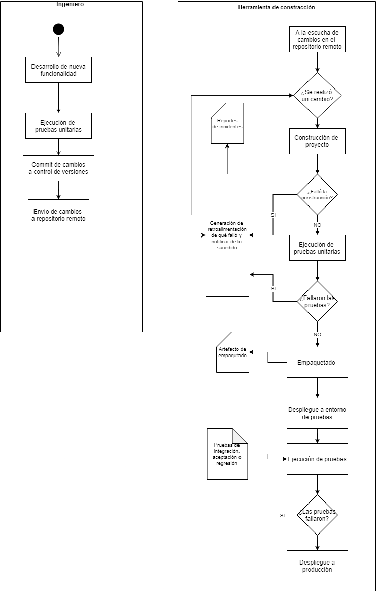


# Administración de la infraestructura

## Administración de la infraestructura

##### Nombre:

Infraestructure Management

##### Tipo:

Proceso DevOps

##### Propósito 

Proporcionar la infraestructura y servicios adecuados a los proyectos
para apoyar los objetivos de la organización y del proyecto a lo largo
del ciclo de vida.

##### Salidas

-   Se proporciona la infraestructura de red para soportar DevOps.

-   Se implementan mecanismos de comunicación continua para soportar
    DevOps a lo largo del ciclo de vida.

-   Se implementan servicios de seguridad a lo largo del ciclo de vida.

-   Los procedimientos para la replicación del entorno, por ejemplo,
    para la evaluación de sistemas integrados o mantenimiento, se
    establecen en una fase temprana del ciclo de vida de los sistemas.

-   Se soporta la infraestructura como código (IaC).

##### Tareas

-   Planificar las necesidades de entorno, infraestructura y recursos
    (por ejemplo, para la elaboración de presupuestos, la programación,
    la gestión de cambios o la gestión de riesgos).

-   Especificar los requisitos no funcionales de las características,
    como la fiabilidad, la seguridad, la fiabilidad o la escalabilidad,
    de acuerdo con el contexto de los servicios reales de la
    infraestructura.

-   Prever herramientas de automatización y gestión de la
    configuración (CM) dentro de la cartera de tecnologías de la
    información de la organización.

-   Seleccionar herramientas de planificación y gestión con poca
    sobrecarga y alta visibilidad

-   Implementar herramientas de desarrollo de software, incluyendo
    herramientas de control de versiones y documentar las dependencias
    de los scripts de automatización.

-   Apoyar el enfoque de desarrollo seleccionado con la infraestructura.

-   Implantar una infraestructura que soporte las actividades de
    seguridad, un entorno de pruebas y otras actividades de verificación
    y validación.

-   Habilitar la infraestructura como código (IaC) con el apoyo de los
    análisis de seguridad y cumplimiento.

-   Mantener el análisis de seguridad y conformidad de la IaC.

-   Apoyar el aprovisionamiento de la infraestructura mediante
    mecanismos automatizados con archivos de definición legibles por
    máquina.


## Infraestructura como código

##### Nombre:

Infraestructure as Code (IaC)

##### Tipo:

Práctica DevOps

##### Descripción

Definición, gestión y suministro de componentes de infraestructura
redes, máquinas virtuales, balanceadores de carga y topología de
conexión) mediante software. Al igual que el principio de que el mismo
código fuente genera el mismo binario, un modelo IaC genera el mismo
entorno cada vez que se aplica. IaC es una práctica clave de DevOps y se
utiliza junto con la entrega continua.

##### Beneficios

-   Permite a los equipos de DevOps probar aplicaciones en entornos
    parecidos producción al principio del ciclo de desarrollo.

-   Permite aprovisionar múltiples entornos de prueba de manera
    confiable y bajo demanda

-   Permite la validación y prueba de la configuración para evitar
    problemas de implementación comunes.

-   Los equipos que implementan IaC pueden ofrecer entornos estables
    rápidamente y a escala.

-   Los equipos evitan la configuración manual de entornos y refuerzan
    la coherencia al representar el estado deseado de sus entornos
    mediante código.

-   Las implementaciones de infraestructura con IaC son repetibles y
    evitan problemas de tiempo de ejecución causados por cambios en la
    configuración o dependencias faltantes.

-   Los equipos de DevOps pueden trabajar juntos con un conjunto
    unificado de prácticas y herramientas para entregar aplicaciones y
    su infraestructura de soporte de manera rápida, confiable y a
    escala.

##### Buenas prácticas [@Kumara2021]

###### Escriba programas de IaC para personas, no para computadoras

-   Haga que los nombres sean consistentes, distintivos y significativos

-   Haga que el estilo y el formato del código sean coherentes

-   Hacer explícitos los parámetros, sus tipos y valores predeterminados

-   Usa los condicionales correctamente

###### No te repitas a ti mismo

-   Modularizar programas de IaC

-   Reutilice el código en lugar de reescribirlo

-   Seleccione los módulos adecuados para el trabajo y utilícelos
    correctamente

-   Reutilizar las herramientas que usa la comunidad

###### Deje que las herramientas de IaC hagan el trabajo

-   Codifica todo

-   Empaquetar aplicaciones para implementación

-   No viole la inmutabilidad y reproducibilidad de su infraestructura.

-   No viole la idempotencia de los programas iac

###### Realizar cambios incrementales

-   Utilice un sistema de control de versiones

-   Favorecer las funcionalidades versionables

###### Evita errores evitables

-   Utilice el estilo de cotización correcto

-   Evite comportamientos inesperados siempre que sea posible

-   Utilice los valores adecuados

###### Planifique los errores inevitables

-   Escribe pruebas a medida que codificas

-   No ignores los errores

-   Utilice bibliotecas de prueba listas para usar

-   Supervisa su entorno

##### Tecnologías

-   Terraform

-   Ansible

-   Chef

-   Pulumi

-   Puppet

-   Red Hat Ansible Automation Platfom

-   AWS CloudFormation

-   Saltstack


# Referencias
