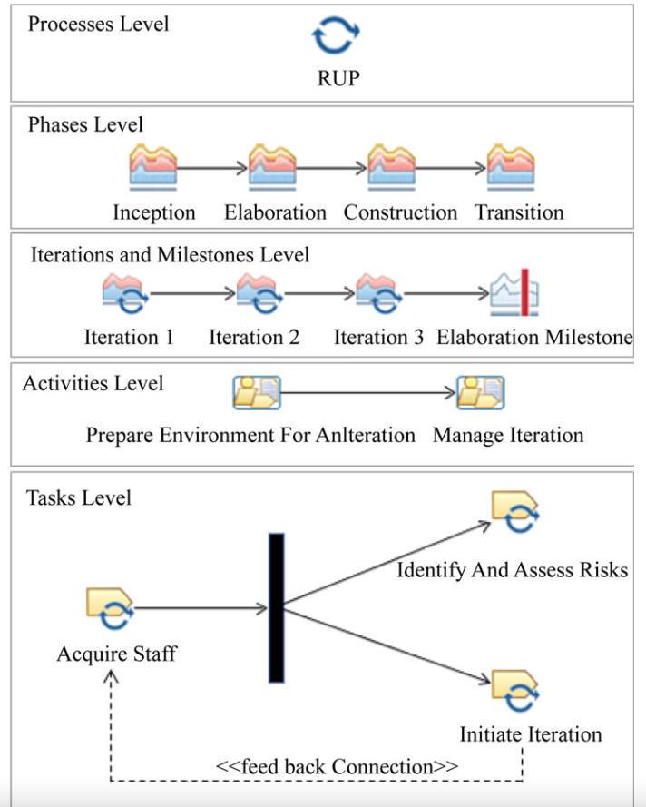
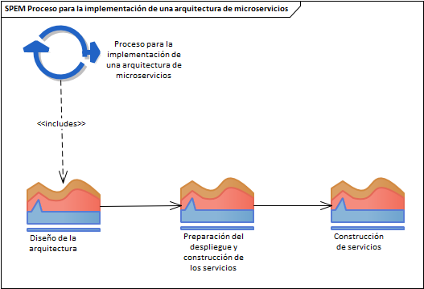

# Procesos para la adopción de microservicios

Para darle un orden darle un orden al conjunto de tareas y actividades, se decidió realizar un modelado del proceso sugerido para la implementación de una arquitectura de microservicios. Para el modelado se usó SPEM, un estándar para definir procesos de software. Como se menciona en la especificación oficial [^1], SPEM permite proveer una representación estandarizada y bibliotecas de contenido reutilizable, soporta desarrollo sistemático, administración y crecimiento de procesos de desarrollo, soporte de despliegue de contenido de métodos y procesos necesitados por configuraciones definidas, entre otros.

El alcance de SPEM está limitado deliberadamente a los elementos mínimos necesarios para definir cualquier proceso de desarrollo de software y sistemas, sin añadir características específicas para dominios o disciplinas de desarrollo particulares.

SPEM utiliza la notación UML *Unified Modeling Language*, provee componentes que permiten representar de manera estandarizada métodos, ciclos de vida, roles, actividades, tareas y productos de trabajo que se usan en la ingeniería de software. Se utilizó en este documento la versión de SPEM 2.0, la cual se utiliza para definir los procesos de desarrollo de software, sistemas y sus componentes.

## Notación

**Fase:**

**Iteración:**

**Actividad:**

**Tarea:**

## Proceso general

Para describir los procesos y actividades siguiendo un enfoque de modelado orientado 
a objetos con base en UML se ha utilizado SPEM. Como punto de partida se definieron 
tres fases principales, las cuales son iterativas y en las que es posible regresar 
si llegara a ser necesario.
La primera fase corresponde al diseño de la arquitectura, es aquí en dónde se toman las 
decisiones respecto a que servicios se crearán, cómo se comunicaran entre 
ellos, cómo se manejará la información y finalmente cómo se desplegaran los 
servicios. Es importante mencionar que no se llevó a cabo el modelado de las actividades 
de todas las iteraciones de la fase de diseño, para los objetivos de esta guía 
solo nos concentramos en la última iteracion la cual definimos como la iteración 
de *Diseño y planeación del despliegue*.

En la segunda fase, se prepara el entorno de desarrollo para cada 
servicio, se definen las actividades a realizar para la construcción,
integración y despliegue de cada servicio así como la estrategia para liberar 
las funcionalidades y observar el comportamiento de cada servicio en un entorno 
de producción. Es en esta fase en donde esta la mayor parte de las actividades 
presentadas en la guía, sin embargo, como sabes estas actividades no son sencillas y 
requieren mucho tiempo e iteraciones refinarlas, por lo tanto es posible comezar las 
actividades e ir mejorandolas y terminandolas conforme se avanza con las siguientes fases.

Finalmente, en la tercera fase se realiza la construcción de los 
servicios así como su integración siguiendo el diseño y procesos definidos en 
las fases anteriores. Esta fase a pesar de estar modelada, no se abarca en la guía y 
tampoco se desarrollaron los diagramas de las actividades que están involucradas 
en esta fase. Si quieres aprender a construir microservicios, te recomendamos que 
utilices alguna de las referencias utilizadas en esta guía, algunas de estas son 
lbros que involucran la construcción de microservicios.

## Indice de la sección

1. [Diseño del despliegue](./diseno.md)
2. [Preparación de la plataforma](./preparacion-plataforma.md)

[^1]: [Software & systems process engineering meta-model specification](https://www.omg.org/spec/SPEM)